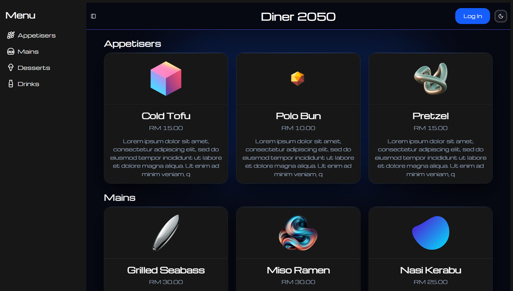
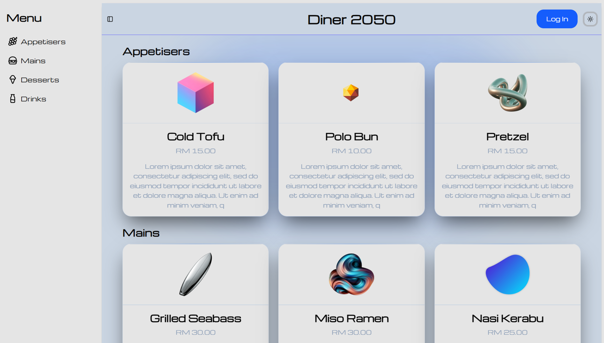
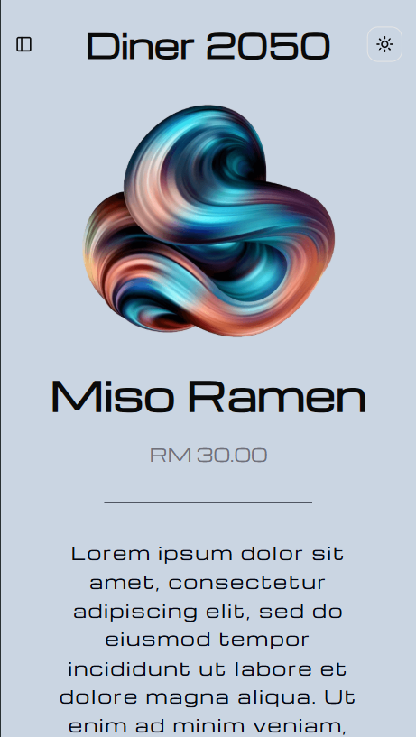

# Diner 2050 🍔
A [digital menu](https://diner2050.vercel.app/) for the most legendary restaurant to come!

This short full-stack project is an exploration of a completely different web development paradigm. In my previous project [Food-4BigTots](https://github.com/szeyoong-low/Food-4BigTots), I used an MVC framework centered around a backend that renders templates in response to client requests. By contrast, the frontend of this app takes on almost all the work of a backend, including routing, middleware, and fetching data. The backend is simply a bunch of API endpoints forming an interface for the database.

I wanted to challenge myself to implement more advanced features that form the backbone of real-world software engineering, including integrating a third-party authentication service, handling user input, making requests to a RESTful API, enforcing type safety, using server-side rendering, and working under a simple CI/CD workflow.

## Tech stack
- **Frontend:**
    - Framework: Next.js, React
    - Language: TypeScript
    - UI: Tailwind CSS, Lucide React, React-icons, Shadcn, Sonner
    - Authentication: auth0
    - Data validation: Zod
- **Backend:**
    - Strapi headless content management system (CMS)
- **Database:**
    - Implementation: PostgreSQL (implemented by Strapi)
    - Query generation: qs
    - Testing: Postman
- **Deployment:**
    - Frontend: Vercel
    - Backend: Strapi Cloud
    - CI/CD: Git

## CRUD Operations
The authentication token generated when logging in with auth0 enables users to create, edit, and delete items on the menu. Upon submission of the form, the input is processed by a server action (`data/actions`), which validates it against a schema (`data/validation`), before making a request to the relevant Strapi API endpoint (`data/services` and `data/data-api.ts`). Helpful error messages are placed below the input fields, and status updates are shown as toasts.

## UI
The app has support for:
- Both light and dark modes (equally gorgeous, not gonna lie!)

- All device sizes, ranging from mobile to 30" monitors

## CI/CD
Unlike previous projects, this one was always ready to go from the get go. My main branch was always in deployment, and I protected it with a policy that my development branch must be deployed successfully in a Vercel preview environment before merging.

The deployed Strapi backend has a serious cold start problem, which is a common issue among serverless backends. I addressed this by retrying requests if a JSON response is not received. I've complemented this with a cron job that pings the `_health` endpoint every minute to prevent the server function instance from scaling to zero (though it may not be fast enough).

## Areas for improvement
- Turning this into an order management system
    - The biggest missed opportunity is that customers of the diner are unable to make orders through the app. This is laughable given the state of technology in 2050.
- Authentication vs authorisation
    - Currently, anyone can create an account and log in to edit the menu. To create the order management system, we can use session data from the auth0 client to distinguish between customers (who can only make orders) and admins (who can only edit the menu). For the time being, I've decided to forgo this to keep things simple.
    - I chose to use auth0's Next.js software development kit (SDK) instead of the integration with Strapi's user management system. The SDK abstracts away a lot of boilerplate such as implementing authentication routes, managing sessions, and defining middleware. However, there is no interaction with Strapi's user management system.
- A more robust and scalable backend
    - The convenience with which content can be structured and queried using Strapi's CMS makes it perfect for blogs, which mainly interact with the backend to retrieve content. However, it doesn't feel flexible enough to support more complex business logic and databases.
    - Even if it is, I'm not comfortable with how its implementation is parked in my repository yet treated as a black box.
    - While implementing the backend myself with a framework like Spring or Django would be more tedious, I appreciate the customisability and transparency this provides.
    - Also, since these are more commonly used in industry, there are probably more libraries and tools available to streamline particular areas like authentication and database connections. For instance, I came across Neon and Prisma, which can provide a serverless Postgres database while still giving me control over my code.

## Acknowledgements
Their work have been attributed wherever used or adapted in this project. Any omissions are inadvertent.

- Paul Bratslavsky's [Epic Next.js 15 Tutorial](https://strapi.io/blog/epic-next-js-15-tutorial-part-1-learn-next-js-by-building-a-real-life-project) ([repo](https://github.com/PaulBratslavsky/next-strapi-app-qa/tree/01-post)) - API utilities, middleware setup, type definitions, error handling, image submission
- auth0's [Next.js SDK tutorial](https://auth0.com/docs/quickstart/webapp/nextjs) - UI components, colour palette
- Images were sourced from:
    - [Vecteezy](https://www.vecteezy.com/)
    - [Rawpixel](https://www.rawpixel.com/)
    - [Similar PNG](https://similarpng.com/)
    - [NicePNG](https://www.nicepng.com/)
    - [Pngtree](https://pngtree.com/)
    - [Macsha UK](https://www.macsha.co.uk/)
    - [iStock](https://www.istockphoto.com/)
    - [PNGEgg](https://www.pngegg.com/)
